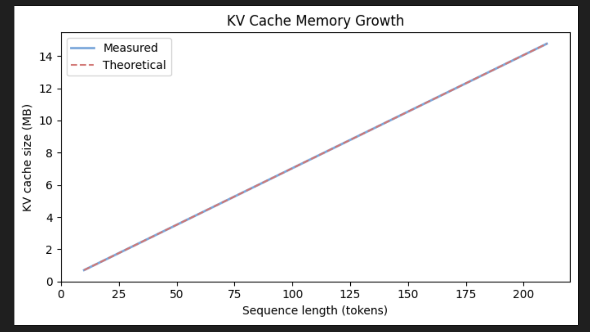
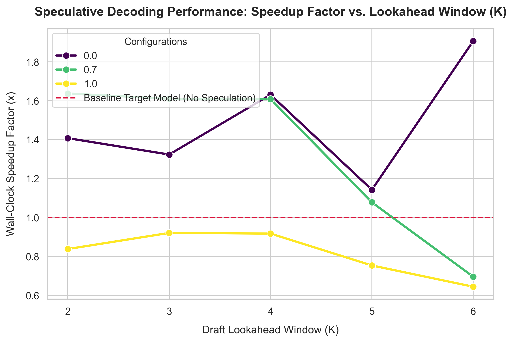

# GPT 2.0 from Scratch

I trained a 124M parameter GPT-2 model from scratch on my 2019, 1.4 GHz Quad-Core Intel Core i5 Macbook Pro.

Further, I:

- Implemented KV-caching and ran experiments to unpack its compute gains and memory costs
- Implemented speculative decoding to understand its inference boost

## Model Architecture


https://excalidraw.com/#json=kEtqwgDj8AgcazuEOskfg,y6R5g3fUyITXRsBLGTsqIQ

## Key Params

- 124M parameters
- 12 transformer layers
- 12 multi head attention modules within each transformer
- GeLU activation for the Feed Forward Network
- Context window: 256 tokens
- Optimization: AdamW with a learning rate of 0.0004 and 0.1 weight decay.
- Embedding dimension: 768
- Stride: 256 (Zero-overlap for maximum data efficiency).
- Tokenizer: Tiktoken (`tiktoken.get_encoding("gpt2")`)
- Input Data: To make it possible to train the model on my personal Macbook Pro, I used a toy dataset - 'The Verdict' by Edith Wharton containing 5120 tokens. However, the same code should work for larger models as well (only that it'll take more time!)
- Train-validation split: 90-10.

## Training Performance

The model was trained for 10 epochs using the AdamW optimizer.

It took 13 minutes on my 2019, 1.4 GHz Quad-Core Intel Core i5 Macbook Pro


## Sample Output

- **Prompt:** "Every effort moves you"
- **Generated:** "Every effort moves you?" "Yes--quite insensible to the irony. She wanted him vindicated--and by me!"

Yes, the generated output doesn't quite match up to a modern LLM, but:

- the architecure follows the real GPT-2.0 closely
- was trained on a much smaller dataset to make it possible on my personal macbook pro
- is not instruction tuned

## Experiments

### 1. KV Caching

KV caching was the first optimization I dug into. Without it, every decode step re-runs attention over the entire sequence generated so far, which is a pile of repeated work that grows quadratically ($O(n^2)$) with length. KV caching stores each token's key and value the first time they're computed and reuses them, so every later step only has to process the single new token, turning the per-step cost from quadratic into linear ($O(n)$).

Concretely, standard inference at decode step $i$ re-processes the whole length-$(P+i)$ sequence ($P$ = prompt length), for a total of $\sum_{i=0}^{G-1}(P+i)^2$ across $G$ generated tokens. With a KV cache the prompt is processed once during prefill, its $K$/$V$ are stored, and each of the $G$ steps attends over the growing cache while computing only the new token, for a total of $P^2 + \sum_{i=0}^{G-1}(P+i)$.

#### Experiment

I implemented inference both with and without the KV cache and compared the wall-clock time on my 124M model.


#### What drives the speedup

To see what actually drives the gain, I worked out the speedup as a ratio of total FLOPs (attention cost grows with sequence_length² per step):

$$\text{Speedup} = \frac{\overbrace{\displaystyle\sum_{i=0}^{G-1}(P+i)^2}^{\text{standard inference}}}{\underbrace{\displaystyle P^2 + \sum_{i=0}^{G-1}(P+i)}_{\text{KV-cache inference}}}$$

Expanding in closed form makes the dependence on $P$ and $G$ explicit:

$$\text{Standard} = \underbrace{G P^2}_{\text{prompt, paid }G\times} +\ \underbrace{P G(G-1)}_{\text{cross}} +\ \underbrace{\tfrac{G(G-1)(2G-1)}{6}}_{\sim\,G^3/3}$$

$$\text{KV-cache} = \underbrace{P^2}_{\text{prefill (once)}} +\ \underbrace{G P}_{\text{cross}} +\ \underbrace{\tfrac{G(G-1)}{2}}_{\sim\,G^2/2}$$

Key implications:

- **Generation length ($G$) dominates.** The numerator grows like $G^3$ while the denominator only grows like $G^2$, so the speedup scales roughly linearly with $G$.
- **Prompt length ($P$) helps too, but less.** A longer prompt adds $GP^2$ to the numerator (amplified $G$ times) versus just $P^2$ to the denominator, so bigger prompts widen the gap, just not as dramatically as longer generation.
- **`total_tokens` is a misleading proxy.** Two configs with the same $P+G$ can land very different speedups depending on how that total splits between prompt and generation.

Applying the formula to representative configs:

| Config (P, G)      | Total tokens | Theoretical speedup |
| ------------------ | ------------ | ------------------- |
| prompt=10, gen=50  | 60           | ~38x                |
| prompt=10, gen=200 | 210          | ~173x               |
| prompt=200, gen=50 | 250          | ~50x                |
| prompt=50, gen=200 | 250          | ~159x               |

Two configs with the same total tokens (250) differ by **3x** in speedup, purely because gen_len differs.

#### Findings

- **What I measured didn't line up with the formula.** Empirically `prompt=200, gen=50` came out _faster_ than `prompt=50, gen=200`, the opposite of what the FLOP math predicts. The reason turned out to be per-step overhead: each KV-cache decode step carries a fixed cost (Python loop, PyTorch dispatch, memory allocation) that doesn't depend on sequence length, and with $G=200$ that overhead piles up 4x more than with $G=50$. Since the cached FLOP cost per step is already tiny, the fixed overhead becomes a large fraction of each step and dilutes the speedup when $G$ is large. The gap should close on a GPU running a big model, where real compute dominates the overhead.
- **The speedup trades compute for a memory-bandwidth bottleneck.** Standard inference is compute-bound; KV caching shifts the bottleneck to memory bandwidth, since the cache has to be streamed from VRAM on every decode step. Flash Attention helps with that, but it's a CUDA kernel optimization, so it does nothing for my CPU setup.

| Feature            | Standard Inference             | KV-Cache Inference          |
| ------------------ | ------------------------------ | --------------------------- |
| Computation        | Recomputes all previous tokens | Computes only the new token |
| Time per Token     | Increases per step             | Constant                    |
| Complexity         | $O(n^2)$                       | $O(n)$                      |
| Primary Bottleneck | GPU Compute (FLOPs)            | Memory Bandwidth (IO)       |

---

#### The memory tradeoff

The speedup isn't free: KV caching buys lower compute by spending memory, and that memory grows linearly with sequence length. Each layer has to hold K and V tensors of shape `(batch, n_heads, seq_len, head_dim)`. For a single new token on my 124M model:

```
bytes_per_token = 2 (K+V) × 12 (layers) × 12 (heads) × 64 (head_dim) × 4 (float32) = 73,728 bytes ≈ 72 KB
```

Over the full 256-token context that works out to `72 KB × 256 ≈ 18 MB`.



- The cache size is **fully predictable**: my measured and theoretical lines overlap exactly.
- It grows linearly with sequence length, capped at `context_length` tokens.
- This stays small for a 124M model, but it's the same mechanism that makes memory a real problem at scale: a 70B model at float16, batch 32, and 128K context pushes the KV cache into the hundreds of GB.

<!-- TODO: add a plot showing projected cache size for larger models (7B, 70B) to make the scaling concrete -->

<!-- TODO: Architecture Decisions section — explain WHY each choice was made:
  - Pre-norm (LayerNorm before attention) vs post-norm: pre-norm stabilises training at depth
  - GELU vs ReLU: GELU is smoother, empirically better for transformers
  - Weight tying (out_head shares weights with token embedding): reduces params, regularises, aligns embedding/unembedding spaces
  - No bias in QKV projections: reduces overfitting, common in modern LLMs
  - AdamW over Adam: decoupled weight decay avoids L2-on-adaptive-lr interaction
-->

<!-- TODO: Sampling Strategies section — temperature, top-k, top-p:
  - Temperature: scales logits before softmax — lower = more deterministic, higher = more random
  - Top-k: truncate to k highest-probability tokens before sampling
  - Top-p (nucleus): truncate to smallest set of tokens whose cumulative prob ≥ p
  - Show how output quality changes across (temp=0.1, top_p=0.9) vs (temp=1.0, top_k=50)
-->

### 2. Speculative Decoding

As part of this project I went deep on speculative decoding, and it's easily one of my favorite LLM optimizations I've come across. It speeds up autoregressive generation by having a small, cheap _draft_ model guess several tokens ahead, then letting the big _target_ model check all of those guesses in a single forward pass instead of producing one token at a time. The clever bit is the accept/reject rule it uses to decide which guesses to keep. It's built so the final output has the exact same probability distribution as running the big model alone, which means the speedup comes for free with no drop in quality.

#### Setup

To measure the gains, I downloaded pretrained GPT-2 weights from OpenAI and loaded them into the same model architecture I'd built from scratch earlier in this project (with a bit of key remapping to match my layer names). I used GPT-2 small (124M) as the draft and GPT-2 medium (355M) as the target. Both are big enough to be meaningful, but small enough to sit in memory on my laptop at once.

#### Experiment

I generated 50 tokens from a long, grounded prompt and swept two knobs: the sampling temperature (0.0, 0.7, 1.0) and the lookahead K, i.e. how many tokens the draft guesses before each round of verification (2 through 6). For every combination I logged the acceptance rate, the number of target forward passes, and the wall-clock throughput, measured against a plain autoregressive run of the target model at the same temperature.

#### Results

| Temp | K   | Acceptance | Target fwd passes | Tokens/sec | Speedup   |
| ---- | --- | ---------- | ----------------- | ---------- | --------- |
| 0.0  | 2   | 0.636      | 22                | 2.54       | 1.41×     |
| 0.0  | 3   | 0.544      | 19                | 2.38       | 1.32×     |
| 0.0  | 4   | 0.750      | 13                | 2.94       | 1.63×     |
| 0.0  | 5   | 0.488      | 16                | 2.06       | 1.14×     |
| 0.0  | 6   | **0.759**  | **9**             | **3.44**   | **1.91×** |
| 0.7  | 2   | 0.690      | 21                | 2.54       | 1.64×     |
| 0.7  | 3   | 0.611      | 18                | 2.50       | 1.61×     |
| 0.7  | 4   | 0.600      | 15                | 2.50       | 1.61×     |
| 0.7  | 5   | 0.435      | 17                | 1.67       | 1.08×     |
| 0.7  | 6   | 0.235      | 22                | 1.08       | 0.70×     |
| 1.0  | 2   | 0.462      | 26                | 1.54       | 0.84×     |
| 1.0  | 3   | 0.420      | 23                | 1.69       | 0.92×     |
| 1.0  | 4   | 0.413      | 20                | 1.68       | 0.92×     |
| 1.0  | 5   | 0.347      | 19                | 1.38       | 0.75×     |
| 1.0  | 6   | 0.203      | 23                | 1.18       | 0.64×     |



**Average speedup by temperature:**

| Temp | Avg speedup              |
| ---- | ------------------------ |
| 0.0  | **1.48×**                |
| 0.7  | 1.33×                    |
| 1.0  | **0.82× (net slowdown)** |

#### Findings

- **The speedup is real when the two models agree often, and that mostly happens at low temperature.** At T=0 it averaged 1.48x and peaked at 1.91x (K=6), where the draft's guesses were good enough that 50 tokens needed only 9 target forward passes instead of 50.
- **It's a poor fit for creative, high-temperature generation.** At T=1.0 the acceptance rate fell to roughly 0.2 to 0.46 and speculative decoding was actually _slower_ than the baseline (0.82x average). A higher temperature makes both models sample more randomly, so they agree less often, the draft's guesses get rejected, and all of that draft compute is wasted.
- **A bigger lookahead K is not automatically better.** A large K only pays off when acceptance stays high. At T=0 a large K helped (K=6 was the fastest run), but at T=0.7 that same K=6 dropped to 0.70x, because every rejected guess throws away all K of the draft passes that produced it.
- **The number of target forward passes tracked the speedup closely.** The target pass is the expensive step, so fewer of them means faster generation, and K=6 at T=0 cleared 50 tokens in just 9 passes. The catch is that a large K also adds draft passes, so there is a sweet spot rather than a 'bigger is better' rule.

#### Future improvements

- **Average over many prompts.** Everything above comes from a single prompt, so the per-cell numbers are noisy. The K=5 dip at T=0, for instance, is probably just variance. Averaging over 20 to 30 prompts would give per-cell curves worth trusting; for now the per-temperature averages are the part I'd stand behind.
- **Run it on a GPU.** These are CPU wall-clock numbers. The picture shifts with batching and a wider speed gap between the draft and target.
- **Try instruction-tuned models.** They converge on more predictable text than base models, so the acceptance rate, and the speedup, should both go up.

## Further Work

- Created a visualizer to showcase what the model was "thinking" at each step as it processed an input. Verify that "Reasoning" happens in the middle layers, while "Grammar" happens in the later layers.
- Blog ideas
  - What is the semantic meaning of having residual connections?
  - How gradients flow across the model (including through the different transformer blocks) and how new information gets added at each layer.
  - Can we _see_ what's flowing through the model or what it is "thinking"?
  - How does data flow through the transformer, in terms of the original input x?

## How to run

`uv run jupyter lab`

## Acknowledgements

Most of the core LLM implementation in this repo follows `Build a Large Language Model` by `Sebastian Raschka`.

> Raschka, Sebastian. Build A Large Language Model (From Scratch). Manning, 2024. ISBN: 978-1633437166.

## Author

Vidhant Maini

2026
